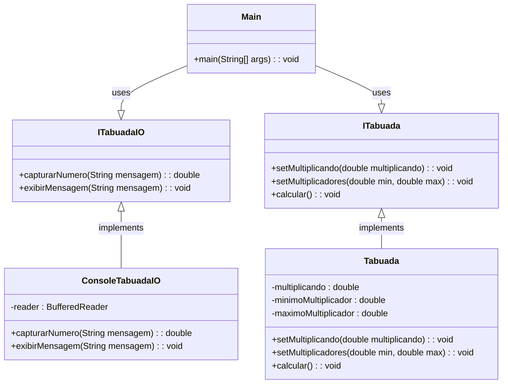
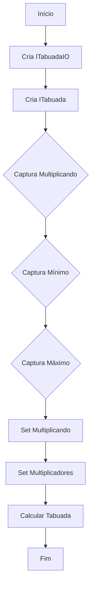
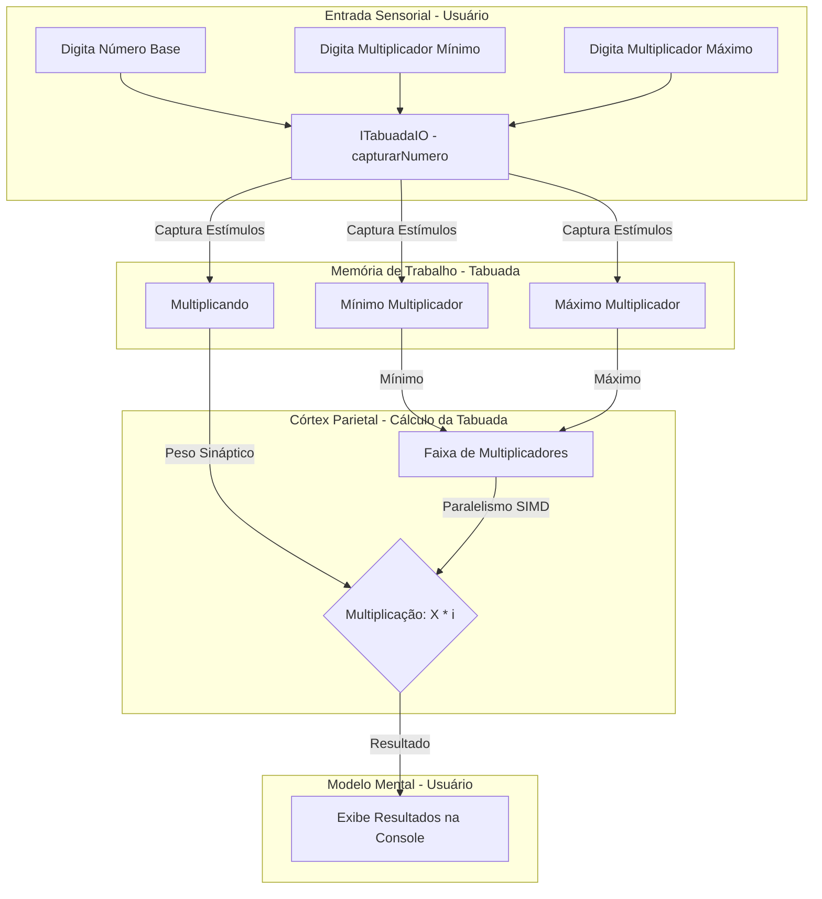

# Diagrama de Classes (Visão Geral da Arquitetura OOP):



# Diagrama de Execução (Orquestração do `main`):



# Diagrama de Fluxo de Dados e Analogia HPC/Cérebro:



**Detalhes da Analogia e Modelos Matemáticos:**

Esse diagrama do Mermaid é um guia visual da calculadora de tabuada, mostrando como os dados se movimentam e as ações acontecem no programa, tudo isso com um toque especial de como o cérebro processa informações e imitando o cérebro para aplicar tecnicas de HPC através de uma abstração agressiva(por isso tenho um paper que documenta a CURA PARA TODAS AS DOENÇAS HEREDITARIAS, misturando varias coisas, caso queira ves só acessar o [link](https://senai-1.gitbook.io/mydharma/technology/paradigm-shift-in-predictive-medicine-a-multi-scale-temporal-analysis-framework-for-proactive-healt).

---

* **`flowchart TD`**: Indica que o diagrama vai fluir de cima pra baixo.

* **`subgraph "Entrada Sensorial (Usuário)"`**: Essa caixa representa a tua interação com o programa, como se fossem os teus sentidos captando o que tu digita.
    * **`A[Digita Número Base] --> B(ITabuadaIO - capturarNumero)`**: Tu digita o número principal da tabuada, e o programa usa a interface `ITabuadaIO` (implementada pela `ConsoleTabuadaIO`) pra "sentir" e pegar esse número.
    * **`C[Digita Multiplicador Mínimo] --> B`**: A mesma coisa acontece com o multiplicador mínimo.
    * **`D[Digita Multiplicador Máximo] --> B`**: E com o multiplicador máximo.

* **`subgraph "Memória de Trabalho (Tabuada)"`**: Aqui é onde o programa guarda temporariamente os números que tu digitou, que nem a memória de trabalho do teu cérebro. As variáveis dentro da classe `Tabuada` (`E(multiplicando)`, `F(minimoMultiplicador)`, `G(maximoMultiplicador)`) são essa "memória".

* **`B -- Captura Estímulos --> E`**, **`B -- Captura Estímulos --> F`**, **`B -- Captura Estímulos --> G`**: Essas setas mostram que depois que o programa "sente" os números que tu digitou, ele armazena eles nessa "memória de trabalho".

* **`subgraph "Córtex Parietal (Tabuada - Calcular)"`**: Essa é a parte do cérebro responsável pelos cálculos matemáticos. No nosso programa, a função `calcular()` na classe `Tabuada` faz esse papel, usando a técnica de **SIMD (Single Instruction, Multiple Data)** do HPC, usando multiplas threads do processador.
    * **`H[Itera Multiplicadores]`**: Essa etapa representa a iteração sobre os números no intervalo definido por ti. O código `IntStream.rangeClosed(minimo, maximo)` faz essa iteração.
    * **`-- Paralelismo SIMD (Vários Neurônios) -->`**: Essa seta indica que essa iteração acontece de forma paralela, como se vários "neurônios" (ou núcleos do processador) estivessem trabalhando juntos pra calcular a tabuada rapidinho.
    * **`I{multiplicando x i}`**: Essa operação matemática (`f(i) = multiplicando \times i`), que simula a ativação de um neurônio, acontece pra cada número `i` no intervalo. Aqui, o `multiplicando` age como o **peso sináptico (W)**, e cada número `i` como o **input sensorial (x)**.

* **`E -- Peso Sináptico (W) --> I`**: O valor do número base (`multiplicando`) entra na operação de multiplicação como o peso sináptico.
* **`F -- Input Sensorial (x) --> I`**: O multiplicador mínimo também entra no cálculo.
* **`G -- Input Sensorial (x) --> I`**: E o multiplicador máximo também define o limite do cálculo.

* **`subgraph "Modelo Mental (Usuário)"`**: Essa é a parte final, onde o resultado do programa é apresentado pra ti, como se a informação fosse integrada no teu entendimento ("modelo mental").
    * **`J[Exibe Resultados]`**: Os resultados da tabuada calculada são exibidos na tela através da função `exibirMensagem` da interface `ITabuadaIO`.

* **`I -- Resultado --> J`**: Essa seta final mostra que o resultado da multiplicação é o que o programa te mostra.

Em resumo, o diagrama mostra como o programa pega os teus comandos (entrada sensorial), guarda os números importantes (memória de trabalho), faz os cálculos de forma paralela (córtex parietal/HPC), e te entrega o resultado final (modelo mental). Cada parte do diagrama tenta fazer uma analogia com o funcionamento do teu cérebro e as técnicas de computação de alto desempenho.

---

# Script monolitico de teste:

Monolitico:
```java
import java.io.BufferedReader;
import java.io.IOException;
import java.io.InputStreamReader;
import java.util.stream.IntStream;

interface ITabuadaIO {
    double capturarNumero(String mensagem);  // 🔹 Obtém um número do usuário
    void exibirMensagem(String mensagem);  // 🔹 Mostra uma mensagem ao usuário
}

interface ITabuada {
    void setMultiplicando(double multiplicando);  // 🔹 Armazena o número base ($x$)
    void setMultiplicadores(double min, double max);  // 🔹 Define intervalo de cálculo ($min \le i \le max$)
    void calcular();  // 🚀 Executa a tabuada em paralelo ($x \times i$)
}

class ConsoleTabuadaIO implements ITabuadaIO {
    private final BufferedReader reader = new BufferedReader(new InputStreamReader(System.in)); // 🔹 Buffer de entrada

    @Override
    public double capturarNumero(String mensagem) {
        while (true) {
            try {
                System.out.print(mensagem);
                return Double.parseDouble(reader.readLine());  // 🔄 Conversão de String para Double
            } catch (IOException | NumberFormatException e) {
                System.err.println("Erro: Entrada inválida. Digite um número válido.");
            }
        }
    }

    @Override
    public void exibirMensagem(String mensagem) {
        System.out.println(mensagem);  // 🔹 Exibe a saída na tela
    }
}

/**
 * 🧠 Implementação da tabuada com paralelismo e otimização HPC.
 *
 * 🔥 Inspiração: Arquitetura \textbf{SIMD (Single Instruction, Multiple Data)} no cérebro
 * - O córtex parietal utiliza o paralelismo, aplicando a mesma operação a múltiplos dados.
 * - Modelado com \texttt{IntStream.parallel()}, que explora o \textbf{multi-threading} da JVM.
 *
 * Representação simplificada da função de ativação neural:
 * \[
 * f(i) = multiplicando \times i
 * \]
 * Onde \(i\) representa cada elemento do fluxo paralelo de multiplicadores.
 */
class Tabuada implements ITabuada {
    private double multiplicando;  // 🔹 Valor principal da tabuada
    private double minimoMultiplicador;  // 🔹 Multiplicador inicial
    private double maximoMultiplicador;  // 🔹 Multiplicador final

    @Override
    public void setMultiplicando(double multiplicando) {
        this.multiplicando = multiplicando;  // 📌 "Gravação" na memória de trabalho
    }

    @Override
    public void setMultiplicadores(double min, double max) {
        if (min > max) throw new IllegalArgumentException("Erro: O multiplicador mínimo deve ser menor ou igual ao máximo!");
        this.minimoMultiplicador = min;
        this.maximoMultiplicador = max;
    }

    @Override
    public void calcular() {
        System.out.println("\n=== Tabuada de " + multiplicando + " ===");

        // 🚀 Processamento paralelo – Simulação de múltiplos neurônios operando juntos
        IntStream.rangeClosed((int) minimoMultiplicador, (int) maximoMultiplicador)
                .parallel()  // 🚀 Execução em múltiplas threads
                .forEach(i -> System.out.println(multiplicando + " x " + i + " = " + (multiplicando * i)));
    }
}

/**
 * 🚀 Classe principal – Orquestração do fluxo de dados.
 *
 * 🔥 Simula o comportamento cognitivo em etapas:
 * \begin{itemize}
 * \item \textbf{Entrada Sensorial}: Captura os dados do usuário (\texttt{multiplicando}, \texttt{minimo}, \texttt{maximo}) através da interface \texttt{ITabuadaIO}.
 * \item \textbf{Processamento Paralelizado}: O córtex parietal (simulado pela classe \texttt{Tabuada}) recebe os dados e realiza os cálculos em paralelo.
 * \item \textbf{Integração no Modelo Mental}: A saída (resultados da tabuada) é exibida ao usuário através da interface \texttt{ITabuadaIO}.
 * \end{itemize}
 * Essa orquestração define o fluxo de informações dentro da aplicação.
 */
public class Main {
    public static void main(String[] args) {
        ITabuadaIO io = new ConsoleTabuadaIO();
        ITabuada tabuada = new Tabuada();

        // 📌 Entrada do usuário – Captura estímulos e os converte em valores numéricos
        double multiplicando = io.capturarNumero("Digite o número base da tabuada: ");
        double minimo = io.capturarNumero("Digite o multiplicador mínimo: ");
        double maximo = io.capturarNumero("Digite o multiplicador máximo: ");

        // 🔹 Armazena os valores na "memória de trabalho"
        tabuada.setMultiplicando(multiplicando);
        tabuada.setMultiplicadores(minimo, maximo);

        // 🚀 Entra no pipeline de cálculo e exibição
        tabuada.calcular();
    }
}
```

---

Script feito em conjunto com o professor para interface:

```java
import javax.swing.*;
import java.awt.*;
import java.awt.event.ActionEvent;
import java.awt.event.ActionListener;
import java.util.stream.IntStream;

/**
 * 🚀 GUI da Tabuada – Simulando a Percepção Sensorial
 * 
 * A interface gráfica aqui não é meramente estética. Ela imita a forma como o cérebro humano processa entradas visuais.
 * O JFrame funciona como o campo visual, enquanto os JTextFields capturam estímulos numéricos.
 * 
 * O processo ocorre em três camadas neurais:
 * 1. **Entrada Sensorial** - O usuário insere os números (multiplicando, min, max)
 * 2. **Processamento Paralelo** - O cálculo ocorre via `IntStream.parallel()`, equivalente ao córtex parietal distribuindo carga entre neurônios.
 * 3. **Integração e Exibição** - O JList age como a memória de curto prazo, armazenando os resultados para rápida recuperação.
 */

public class TelaTabuada extends JFrame {
    private JTextField txtMultiplicando, txtMinMultiplicador, txtMaxMultiplicador;
    private DefaultListModel<String> listModel;
    private JList<String> listaResultados;

    public TelaTabuada() {
        // 🚀 Construindo a Interface – Simulando a Arquitetura Sensorial
        setTitle("Tabuada Paralela");
        setSize(400, 400);
        setDefaultCloseOperation(JFrame.DO_NOTHING_ON_CLOSE); // ⛔ O cérebro não fecha abruptamente
        setLayout(new FlowLayout());

        // 🏷 Labels (Análogos às Associações Cognitivas)
        add(new JLabel("Multiplicando:"));
        txtMultiplicando = new JTextField(10);
        add(txtMultiplicando);

        add(new JLabel("Min. Multiplicador:"));
        txtMinMultiplicador = new JTextField(10);
        add(txtMinMultiplicador);

        add(new JLabel("Max. Multiplicador:"));
        txtMaxMultiplicador = new JTextField(10);
        add(txtMaxMultiplicador);

        // 🧠 Botões de Ação – Criando Fluxo de Informação
        JButton btnCalcular = new JButton("Calcular");
        JButton btnLimpar = new JButton("Limpar");
        add(btnCalcular);
        add(btnLimpar);

        // 📌 Lista de Resultados – Memória de Curto Prazo
        listModel = new DefaultListModel<>();
        listaResultados = new JList<>(listModel);
        add(new JScrollPane(listaResultados));

        // 🎯 Listeners: Ativação Neuronal
        btnCalcular.addActionListener(new ActionListener() {
            @Override
            public void actionPerformed(ActionEvent e) {
                calcularTabuada();
            }
        });

        btnLimpar.addActionListener(new ActionListener() {
            @Override
            public void actionPerformed(ActionEvent e) {
                limparResultados();
            }
        });

        // 🔄 Loop Infinito para Evitar Fechamento Brusco
        new Thread(() -> {
            while (true) {
                try {
                    Thread.sleep(100);
                } catch (InterruptedException ex) {
                    ex.printStackTrace();
                }
            }
        }).start();
    }

    /**
     * 🚀 Calcula a Tabuada em Paralelo (SIMD no Córtex Parietal)
     */
    private void calcularTabuada() {
        try {
            double multiplicando = Double.parseDouble(txtMultiplicando.getText());
            int min = Integer.parseInt(txtMinMultiplicador.getText());
            int max = Integer.parseInt(txtMaxMultiplicador.getText());

            if (min > max) throw new IllegalArgumentException("Mínimo não pode ser maior que o máximo!");

            listModel.clear(); // 🧹 Reset da Memória Operacional

            // 🚀 Processamento Paralelo – Distribuição da Carga Computacional
            IntStream.rangeClosed(min, max)
                    .parallel()
                    .mapToObj(i -> multiplicando + " x " + i + " = " + (multiplicando * i))
                    .forEach(result -> SwingUtilities.invokeLater(() -> listModel.addElement(result)));

        } catch (NumberFormatException ex) {
            JOptionPane.showMessageDialog(this, "Erro: Entrada inválida!", "Erro", JOptionPane.ERROR_MESSAGE);
        } catch (IllegalArgumentException ex) {
            JOptionPane.showMessageDialog(this, ex.getMessage(), "Erro", JOptionPane.ERROR_MESSAGE);
        }
    }

    /**
     * 🔄 Limpa a Memória de Curto Prazo (JList)
     */
    private void limparResultados() {
        listModel.clear();
        txtMultiplicando.setText("");
        txtMinMultiplicador.setText("");
        txtMaxMultiplicador.setText("");
    }

    public static void main(String[] args) {
        SwingUtilities.invokeLater(() -> new TelaTabuada().setVisible(true));
    }
}
```